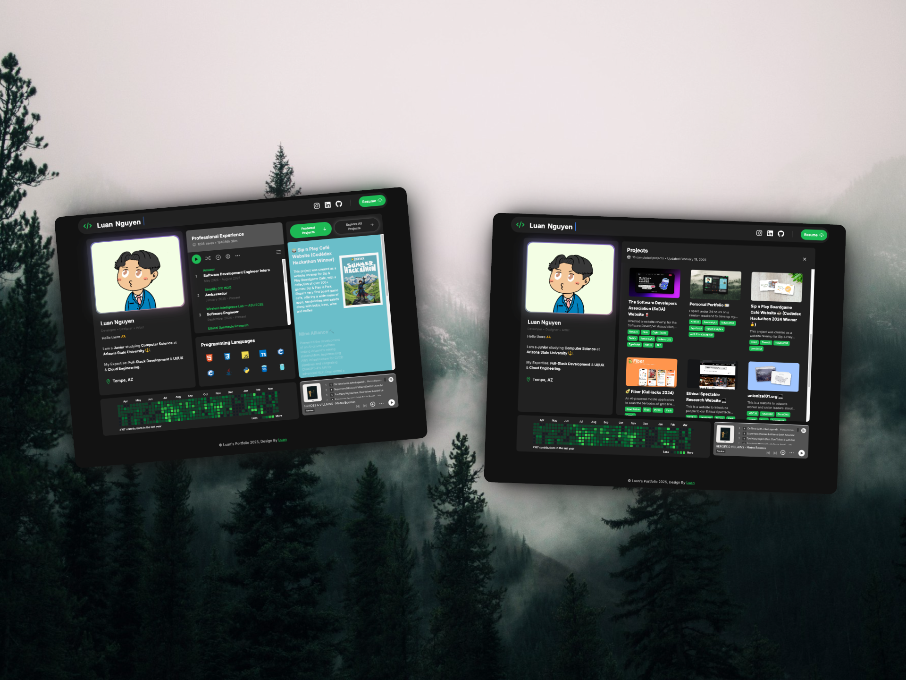

# Personal Portfolio 🪴

A modern, responsive portfolio website featuring a [Spotify](spotify.com)-inspired design.



## Built With 

- **Framework:** [Next.js 15](https://nextjs.org/)
- **Language:** [TypeScript](https://www.typescriptlang.org/)
- **Styling:** [Tailwind CSS](https://tailwindcss.com/)
- **UI Components:** [Aceternity UI](https://ui.aceternity.com/)

## Run

1. **Clone the repository**

   ```bash
   git clone <your-repository-url>
   ```

2. **Install dependencies**

   ```bash
   npm install
   ```

3. **Start development server**
   ```bash
   npm run dev
   ```
   Open [http://localhost:3000](http://localhost:3000) in your browser

## 📄 License

This project is licensed under the MIT License - see the [LICENSE](LICENSE) file for details.

---

Give a ⭐️ if you like this project

Made with ❤️ by [Aryan Kumar](https://www.linkedin.com/in/aryankumar/)
